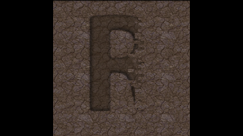
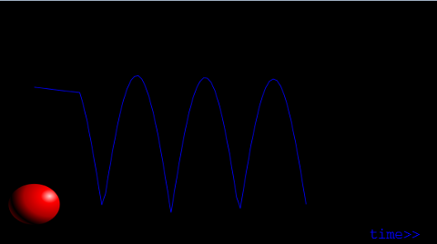

svg-demos
=========

Exploring SVG through scripting with Perl, SVG and XSLT.

Some examples:

[Shatter ](data/shatter-scene.svg)
(procedurally generated animation of rock fragments falling away to reveal chiseled glyph)

[Bounce ](data/bounce.svg)
(procedurally generated animation path for a bouncing ball; hooray!)

[Botanical Slides ](data/xslt-transform.svg)
(interactive /click & rotate/ slides, created with XSLT transformations of an XML catalog of plants into an animated SVG)

*These demos by [Revlin John ](mailto:revlin@uni-sol.org) are licensed under the [Creative Commons Attribution-ShareAlike 3.0 New Zealand License 2013 ](http://creativecommons.org/licenses/by-sa/3.0/nz/deed.en_GB)*
